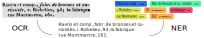

# Code and Data for our paper "Benchmark of NER Approaches in Historical Documents…" presented at [DAS 2022](https://das2022.univ-lr.fr/)



This is our original working repo, and it contains almost everything we used to perform the experiments and write the paper.
As a result, the content may be a bit messy and lack some documentation.
Instead of waiting for it to be perfectly clean, we chose to make it public early and plan to improve it when we have time and on demand.

**Feel free to [submit an issue](https://github.com/soduco/paper-ner-bench-das22/issues/new) if you cannot find what you are looking for.**


## Easy-to-download artifacts
- Official dataset: [](https://doi.org/10.5281/zenodo.6394464)
- Paper's PDF: HAL | arXiv | [GitHub Release](https://github.com/soduco/paper-ner-bench-das22/releases/download/v2.0.0-camera-ready/main-paper.pdf)
- Supplementary material: [GitHub Release](https://github.com/soduco/paper-ner-bench-das22/releases/download/v2.0.0-camera-ready/main-supplementary-material.pdf)
- Presentation slides: [Google slides](https://docs.google.com/presentation/d/1GosXYlkX33KsT7AkA1Avspbae3EvqMNHGKl9TCB5pCU/edit?usp=sharing)


## Code
Except for the annotation platform we used (which is not published yet), we believe most of the code we produced and used in under the `src/` folder.

Code organization:

- `src/ocr/` contains code related to OCR data preparation.
  * We do not include OCR code nor models, but the dataset contains the raw OCR predictions.  
  * It contains a lot of notebooks used to prepare the dataset, and **✨ some normalization and charset stat scripts ✨** may be of some interest to you if you work on OCR evaluation.
  * Our **✨ Python wrapper around UNLV-ISRI OCR evaluation tools ✨** may also be interesting to you as it really speeds evaluation up. Please check the `src/ocr/DEMO.ipynb` notebook and the `src/ocr/README.md` help.
  * There also are, in the notebooks, more statistics about the dataset and OCR scores when using different normalization variants. This was not included anywhere else.
- `src/ner/` contains code related to NER (pre-)training and evaluation.
  * You may be particularly interested in the **✨ pretraining and fine-tuning scripts for CamemBERT ✨**.

## Models
Huggingface BERT models [are shared on Huggingface Hub](https://huggingface.co/HueyNemud) and [on Zenodo](https://doi.org/10.5281/zenodo.6576007).
Users can import any model hosted on [Transformers Python library]([https://huggingface.co/docs/transformers/index](https://huggingface.co/docs/transformers/main_classes/model)), e. g.:
```=python
from transformers import AutoTokenizer, AutoModelForTokenClassification
tokenizer = AutoTokenizer.from_pretrained("HueyNemud/das22-44-camembert_finetuned_pero")
model = AutoModelForTokenClassification.from_pretrained("HueyNemud/das22-44-camembert_finetuned_pero")
```

The SpaCy fine-tuned best model is available in [the Zenodo repository](https://doi.org/10.5281/zenodo.6576007).


## Latex sources
In case you want to copy-paste some table or figure:
- latex sources are in `src-latex/`
- main latex file for the paper is `src-latex/main-paper.tex`
- sub-parts are under `src-latex/parts/`
- some supplementary material is available in `src-latex/main-supplementary-material.tex`

## ✅ TODOs
- [ ] NER: extract pre-training and fine-tuning scripts for CamemBERT to another repo for fast retargeting.
- [ ] OCR: extract OCR evaluation tools (with Python wrapper) to another repo.


## Interesting related work
- http://spacetime.nypl.org/city-directory-meetup
